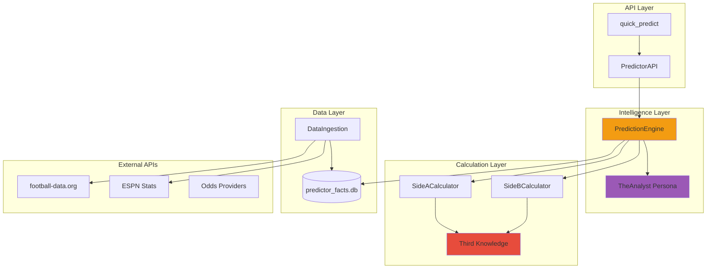
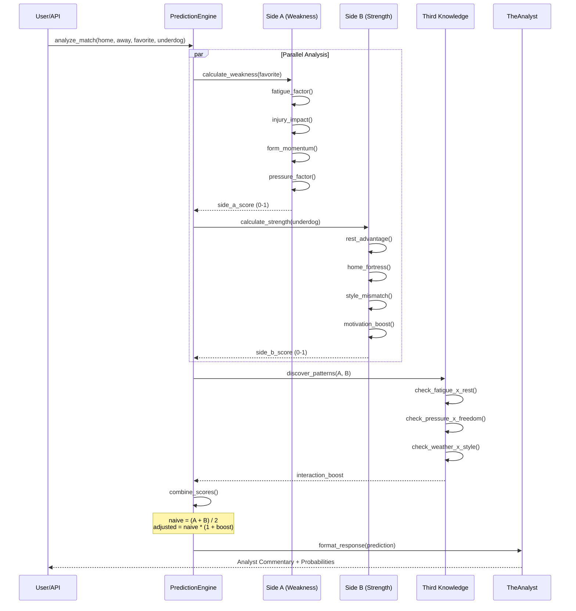
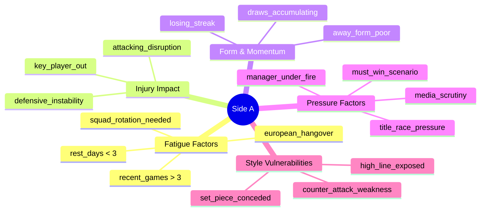
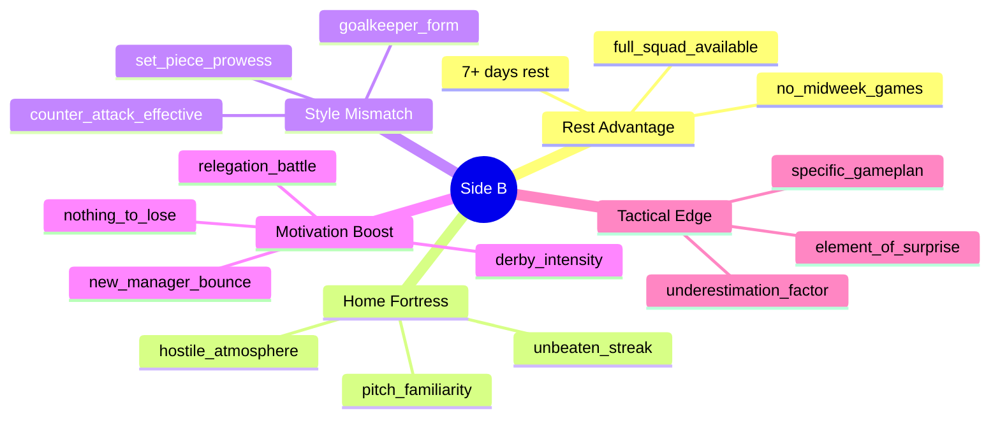
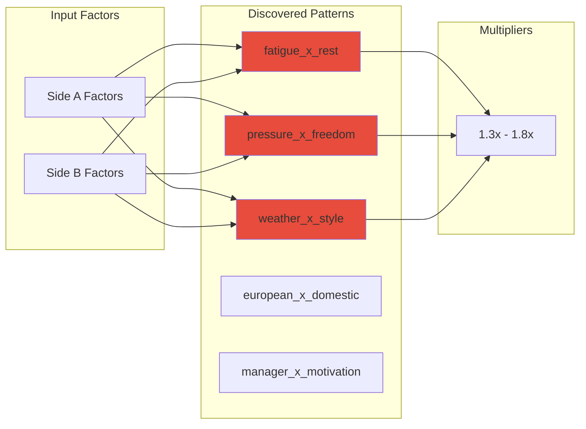
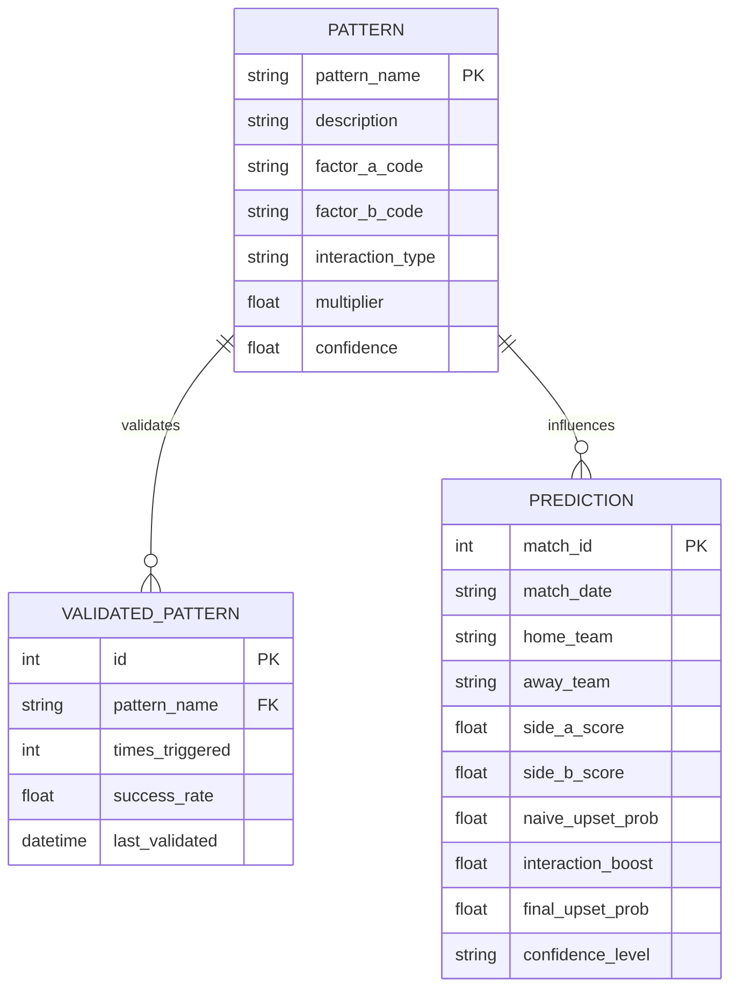
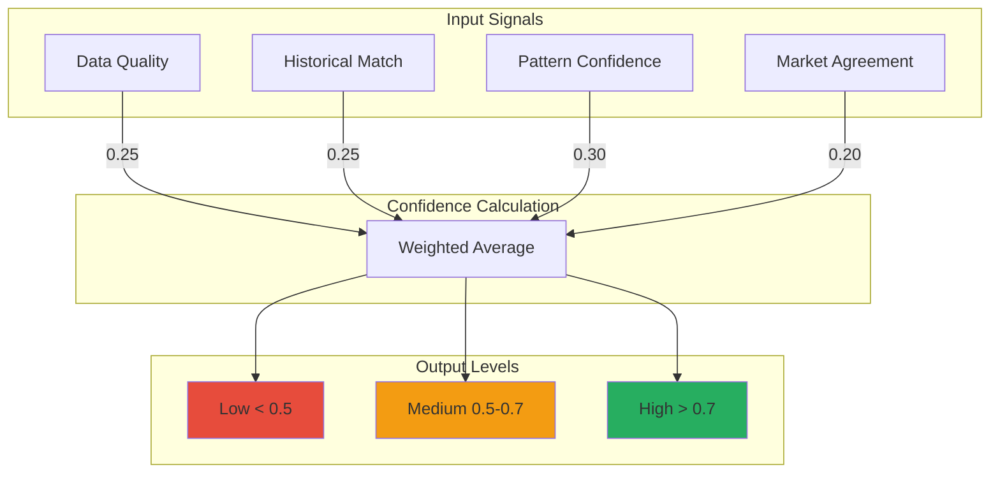
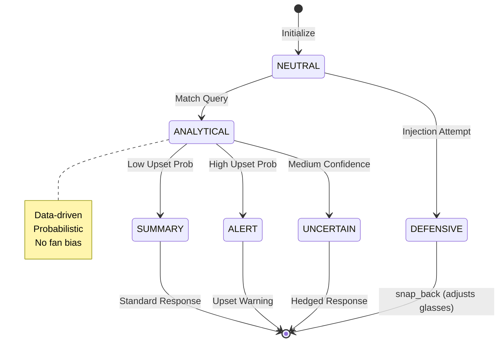

# Predictor System Atlas
## "The Analyst" - Upset Prediction Engine

---

## Core Philosophy

> "The question isn't who SHOULD win.
> The question is: what would make the SHOULD not happen?"

---

## System Architecture



---

## Prediction Flow



---

## Side A: Favorite Weakness Analysis



---

## Side B: Underdog Strength Analysis



---

## Third Knowledge Patterns



---

## Third Knowledge Detail



---

## Confidence Scoring



---

## TheAnalyst Persona



---

## Integration with Fan App

```mermaid
graph TB
    subgraph "Soccer-AI (Fan App)"
        CHAT[Chat Interface]
        CLUB[club=analyst]
        MOOD[(club_mood)]
    end

    subgraph "Predictor"
        ANALYST_API[/api/v1/chat?club=analyst]
        ENGINE[PredictionEngine]
        RESPONSE[AnalystResponse]
    end

    subgraph "Data Exchange"
        MOOD_DATA[Mood Intensity]
        MATCH_RESULT[Match Results]
        PREDICTIONS[Upset Predictions]
    end

    CHAT --> CLUB
    CLUB -->|Routes to| ANALYST_API
    ANALYST_API --> ENGINE
    ENGINE --> RESPONSE
    RESPONSE --> CHAT

    MOOD --> MOOD_DATA
    MOOD_DATA --> ENGINE

    CHAT --> MATCH_RESULT
    MATCH_RESULT --> MOOD

    ENGINE --> PREDICTIONS
    PREDICTIONS --> CHAT

    style ANALYST_API fill:#9b59b6
    style ENGINE fill:#f39c12
```

---

## File Structure

```
backend/predictor/
├── PREDICTOR_SYSTEM_ATLAS.md    # This file
├── __init__.py                  # Package init
├── prediction_engine.py         # Core engine (29KB)
│   ├── ThirdKnowledge           # Pattern dataclass
│   ├── Prediction               # Output dataclass
│   └── PredictionEngine         # Main class
├── side_a_calculator.py         # Favorite weakness (15KB)
│   └── SideACalculator
├── side_b_calculator.py         # Underdog strength (15KB)
│   └── SideBCalculator
├── analyst_persona.py           # TheAnalyst personality (10KB)
│   └── TheAnalyst
├── api.py                       # API endpoints (6KB)
│   ├── PredictorAPI
│   └── quick_predict()
├── data_ingestion.py            # External data (25KB)
│   └── DataIngestion
├── predictor_db.py              # Database layer (14KB)
│   └── PredictorDB
├── data_fetchers/               # External API adapters
│   └── [fetcher modules]
├── MATCH_PREDICTIONS_*.md       # Daily predictions
├── PATTERN_DISCOVERY.md         # Pattern documentation
└── EXTERNAL_APIS.md             # API documentation
```

---

## Current Stats

| Metric | Value |
|--------|-------|
| Side A Factors | 12 |
| Side B Factors | 10 |
| Third Knowledge Patterns | 5 active |
| Confidence Levels | 3 (low/med/high) |
| API Endpoints | 5 |
| Database Tables | 4 |
| Lines of Code | ~3500 |

---

## Key Equations

### Naive Upset Probability
```
naive_prob = (side_a_score + side_b_score) / 2
```

### Adjusted with Third Knowledge
```
interaction_boost = Σ (pattern.multiplier × pattern.confidence)
adjusted_prob = naive_prob × (1 + interaction_boost)
```

### Confidence Score
```
confidence = 0.25 × data_quality
           + 0.25 × historical_accuracy
           + 0.30 × pattern_confidence
           + 0.20 × market_alignment
```

---

## Design Principles

1. **Two-Sided Analysis**: Never predict winners, analyze upset potential
2. **Third Knowledge**: Hidden patterns > obvious factors
3. **Confidence First**: Low confidence = honest uncertainty
4. **No Fan Bias**: TheAnalyst is neutral, data-driven
5. **Closed Loop**: Results feed back to improve predictions

---

*Last Updated: December 21, 2024*
