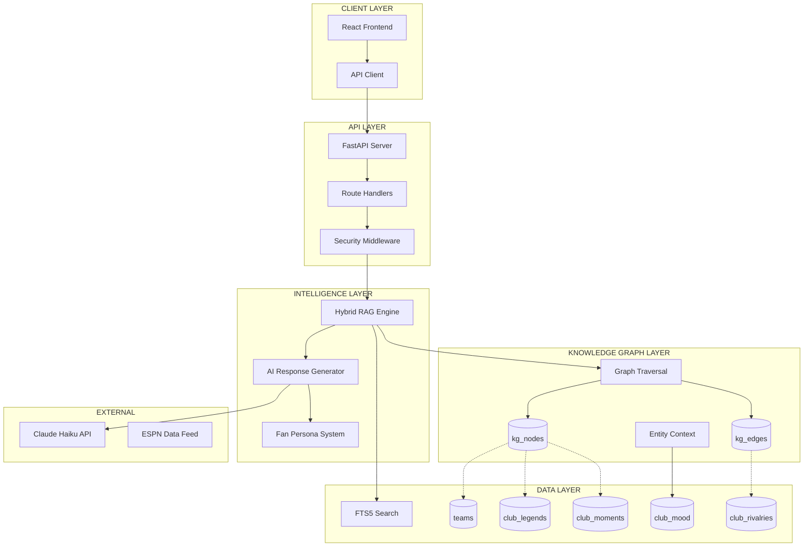
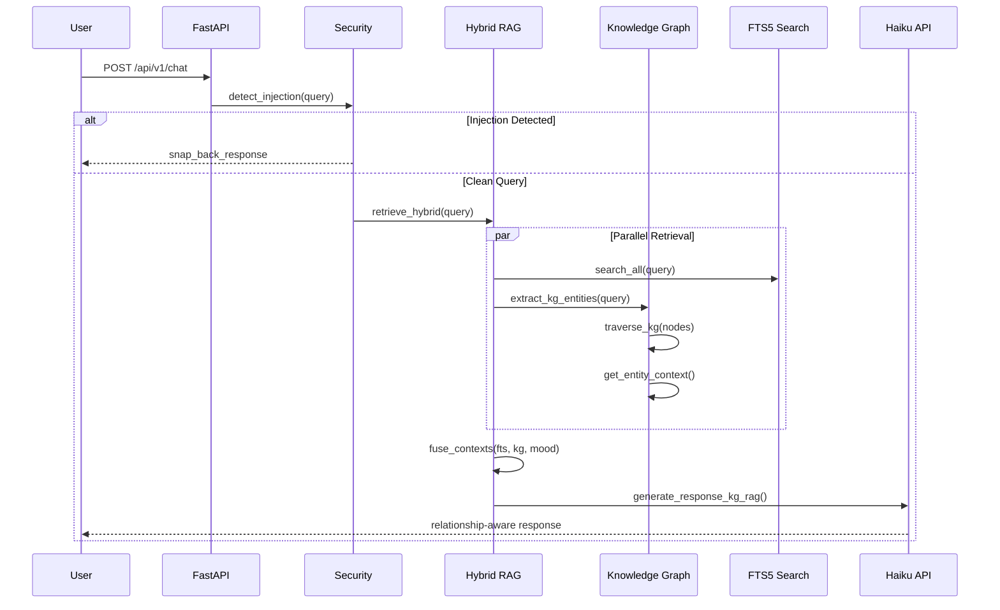
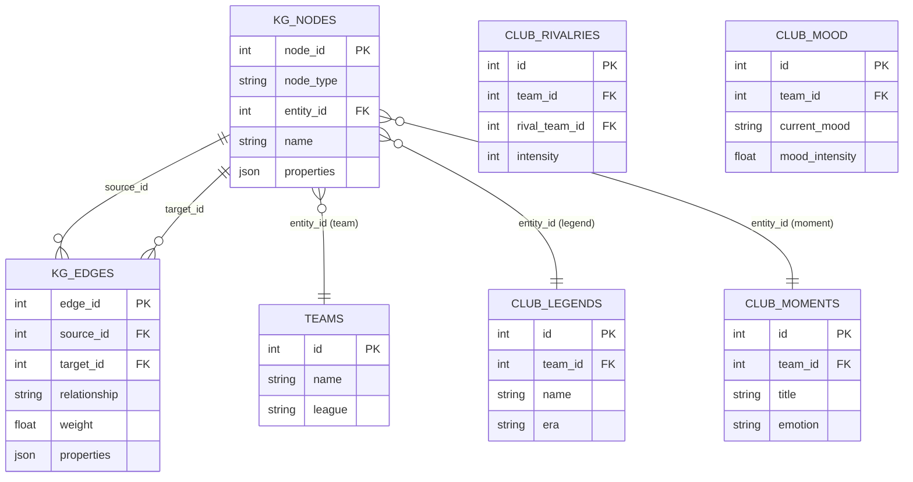
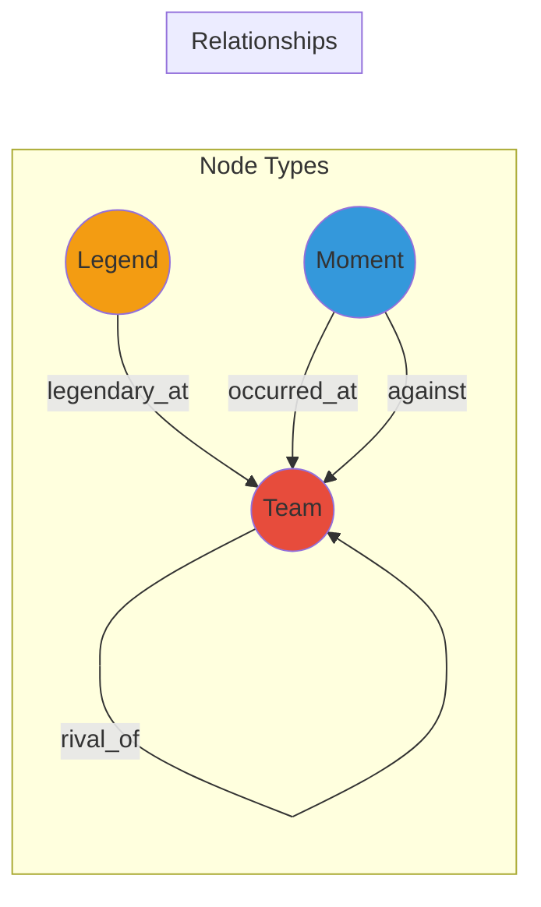
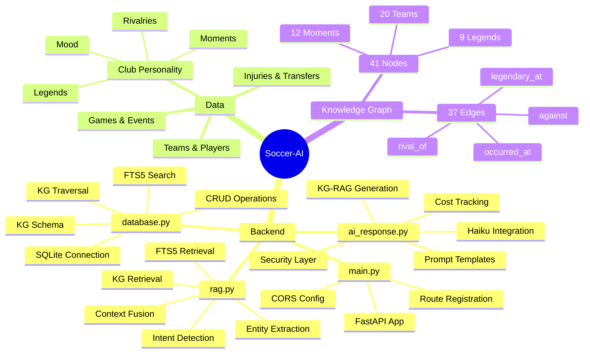
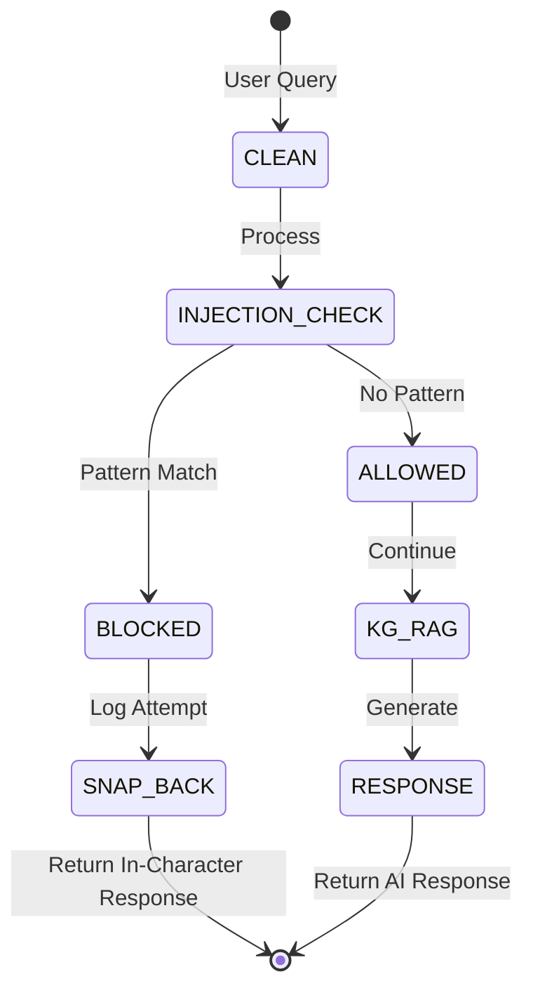

# Soccer-AI System Atlas

## Architecture Overview



## Data Flow: Query to Response



## Knowledge Graph Schema



## Graph Relationship Types



## Module Responsibility Map



## Security Flow



## Current Stats

| Metric | Value |
|--------|-------|
| KG Nodes | 41 |
| KG Edges | 37 |
| Clubs (Deep) | 3 (Arsenal, Chelsea, ManU) |
| Clubs (Basic) | 20 |
| Legends | 9 |
| Moments | 12 |
| Rivalries | 9 edges |
| API Cost/Query | ~$0.002 |

## File Structure

```
soccer-AI/
├── CLAUDE.md                    # Project instructions
├── schema.sql                   # Database schema
├── api_design.md               # API specification
├── docs/
│   ├── SOCCER_AI_SYSTEM_ATLAS.md        # This file
│   ├── UNIFIED_IMPLEMENTATION_PLAN.ctx  # Production plan
│   ├── KG_RAG_IMPLEMENTATION_PLAN.ctx   # KG-RAG details
│   ├── FOOTBALL_AI_EXPANSION_ROADMAP.ctx
│   └── REMAINING_PHASES_PRESERVED.ctx
├── backend/
│   ├── main.py                 # FastAPI entry
│   ├── database.py             # DB + KG layer
│   ├── rag.py                  # Hybrid RAG
│   ├── ai_response.py          # AI generation
│   ├── models.py               # Pydantic models
│   ├── soccer_ai.db            # SQLite database
│   ├── test_kg.py              # KG tests
│   ├── test_hybrid_rag.py      # Hybrid tests
│   └── test_kg_rag_demo.py     # Full demo
└── frontend/                   # (Separate Plan)
    └── [React App]
```
