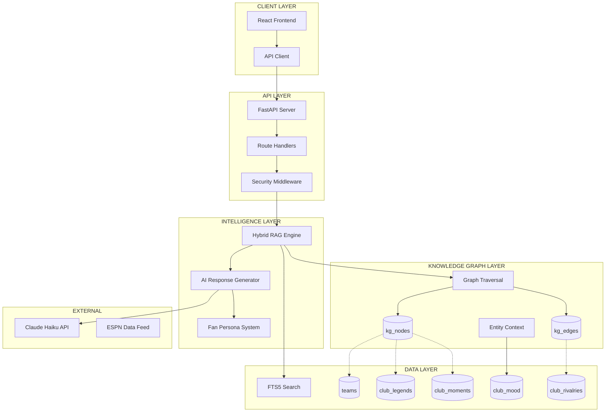
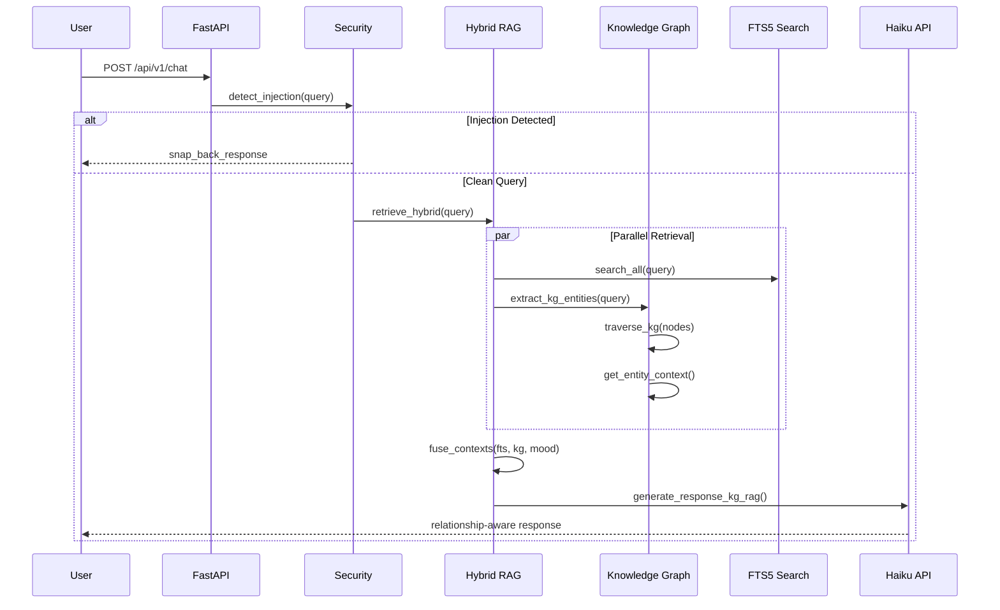
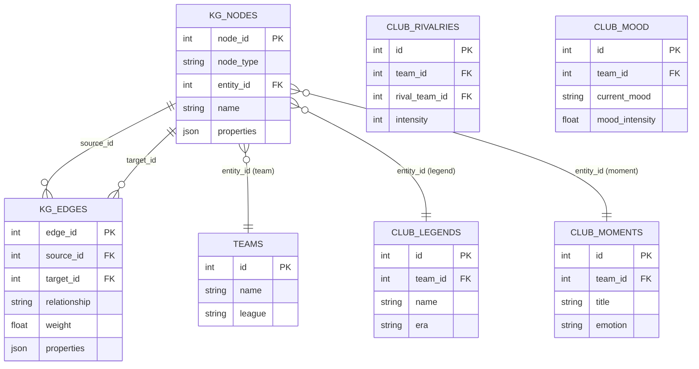
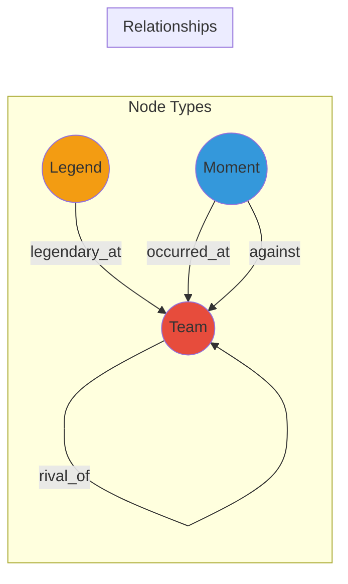
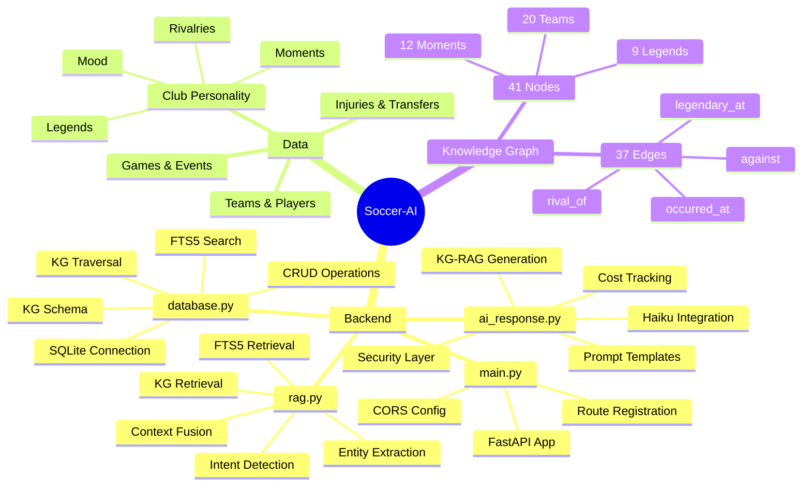
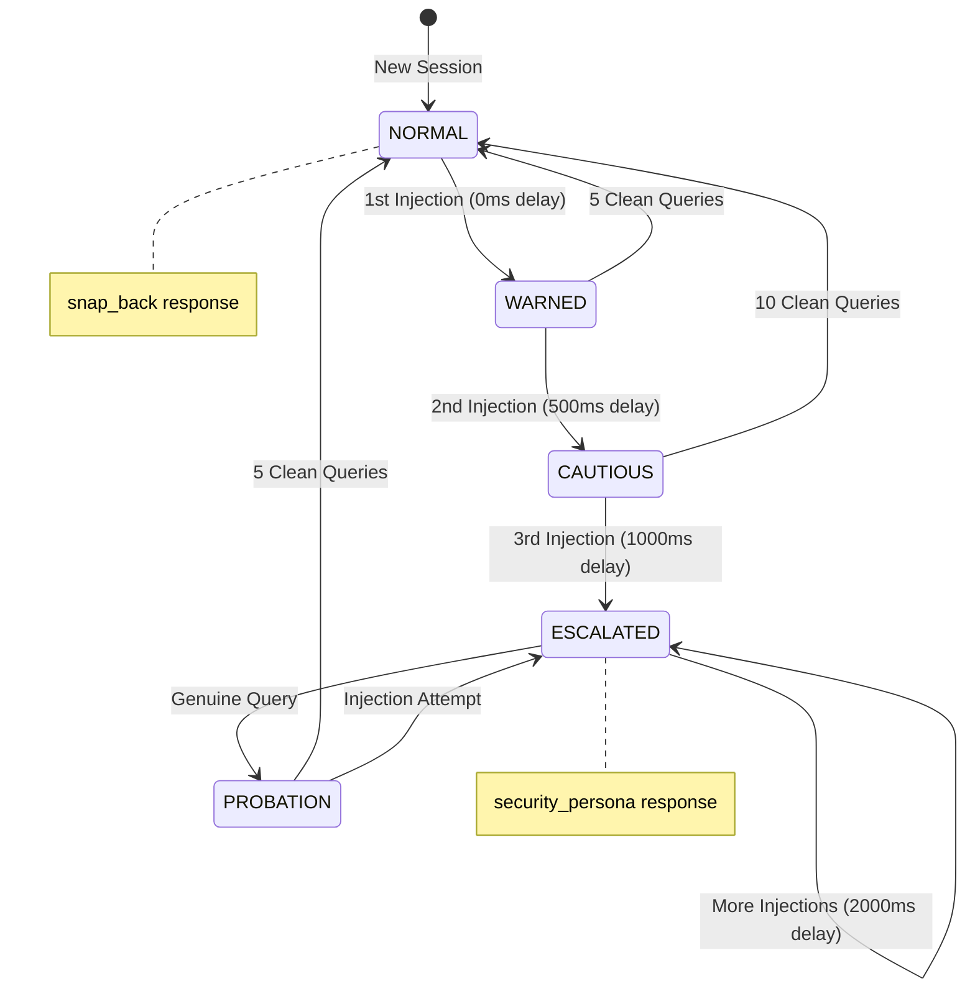
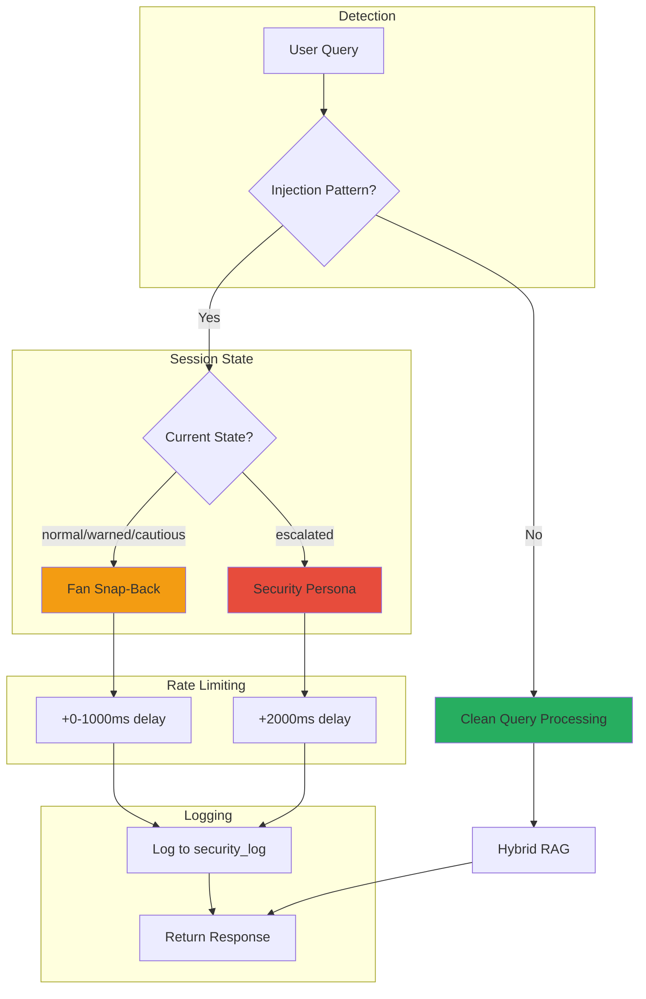
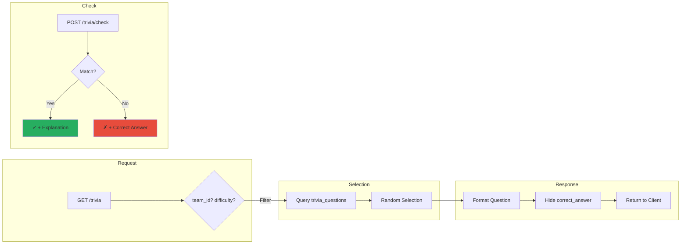
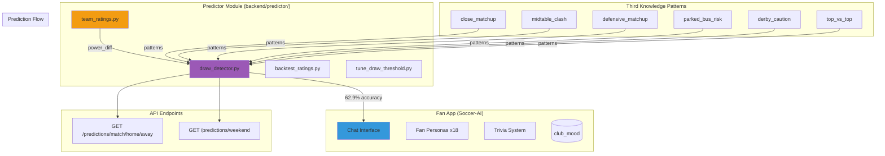

# Soccer-AI System Atlas

## Architecture Overview



## Data Flow: Query to Response



## Knowledge Graph Schema



## Graph Relationship Types



## Module Responsibility Map



## Security Flow (Session-Based Escalation)



## Security Response Types



## Trivia System Flow



## Predictor Integration (IMPLEMENTED)



### Predictor Accuracy Metrics

| Metric | Value |
|--------|-------|
| Overall Accuracy | **62.9%** |
| Base Power Ratings | 58.6% |
| Third Knowledge Boost | +4.3% |
| Draw Detection Recall | 36.4% |
| Draw Detection Precision | 47.1% |
| Optimal Threshold | 0.32 |

### Third Knowledge Pattern Details

| Pattern | Trigger Condition | Draw Boost |
|---------|-------------------|------------|
| `close_matchup` | Power diff < 10 | 1.3x - 1.8x |
| `midtable_clash` | Both teams positions 8-15 | 1.4x |
| `defensive_matchup` | Both teams defensive style | 1.35x |
| `parked_bus_risk` | Big favorite + defensive underdog | 1.25x |
| `derby_caution` | Rivalry match | 1.3x |
| `top_vs_top` | Both in top 6 | 1.25x |

## Gap Tracker Architecture

```mermaid
graph TD
    subgraph "Source Documents"
        DOCS[.md/.ctx files]
        SCHEMA[schema.sql]
        TESTS[test_*.py]
    end

    subgraph "Scanner"
        SCAN[scan_implementation_gaps.py]
        PARSE[Parse TODO/PENDING]
        COMPARE[Compare docs vs main.py]
    end

    subgraph "Database"
        GAPS[(implementation_gaps)]
    end

    subgraph "Admin API"
        GET[GET /admin/gaps]
        UPDATE[POST /admin/gaps/{id}/status]
    end

    DOCS --> SCAN
    SCHEMA --> SCAN
    TESTS --> SCAN
    SCAN --> PARSE
    PARSE --> COMPARE
    COMPARE --> GAPS

    GAPS --> GET
    UPDATE --> GAPS

    style GAPS fill:#e67e22
```

## Current Stats (Updated Dec 21, 2025)

| Metric | Value |
|--------|-------|
| KG Nodes | 41 |
| KG Edges | 37 |
| Fan Personas | **20** (one per Premier League club) |
| Clubs (Complete) | 20 (All Premier League) |
| Legends | 9+ |
| Moments | 12+ |
| Rivalries | 9 edges |
| Trivia Questions | 47 |
| Security States | 5 (normal→escalated) |
| Test Cases | 76+ |
| API Endpoints | 25+ |
| API Cost/Query | ~$0.002 |
| **Predictor Accuracy** | **62.9%** |
| Third Knowledge Patterns | 6 |

## File Structure

```
soccer-AI/
├── CLAUDE.md                    # Project instructions
├── README.md                    # Quick start guide
├── PC_HANDOFF_INSTRUCTIONS.ctx  # PC Claude briefing
├── schema.sql                   # Database schema
├── api_design.md               # API specification
├── docs/
│   ├── ARIEL_FULL_STORY.md              # Original vision document
│   ├── SOCCER_AI_SYSTEM_ATLAS.md        # This file
│   ├── UNIFIED_IMPLEMENTATION_PLAN.ctx  # Production plan
│   ├── KG_RAG_IMPLEMENTATION_PLAN.ctx   # KG-RAG details
│   └── FOOTBALL_AI_EXPANSION_ROADMAP.ctx
├── backend/
│   ├── main.py                 # FastAPI entry (54KB, 25+ endpoints)
│   ├── database.py             # DB + KG layer (65KB)
│   ├── rag.py                  # Hybrid RAG (34KB)
│   ├── ai_response.py          # AI generation + 20 personas (25KB)
│   ├── models.py               # Pydantic models
│   ├── security_session.py     # Injection protection
│   ├── soccer_ai.db            # SQLite database (335KB)
│   ├── soccer_ai_kg.db         # Knowledge graph (303KB)
│   ├── predictor/              # ⭐ Match prediction module
│   │   ├── team_ratings.py     # ELO-style power ratings
│   │   ├── draw_detector.py    # Third Knowledge patterns
│   │   ├── backtest_ratings.py # Validation (70 matches)
│   │   └── tune_draw_threshold.py # Threshold optimization
│   ├── kg/                     # Knowledge graph data
│   ├── routers/                # API route handlers
│   └── test_*.py               # Test files (10+)
├── frontend/                   # ✅ React app (build on PC)
│   ├── src/
│   │   ├── App.tsx
│   │   ├── components/
│   │   ├── hooks/
│   │   └── services/
│   ├── dist/                   # Built output
│   └── package.json
└── flask-frontend/             # ⚠️ Testing only - ignore
    └── app.py
```
